# Palm-veins-identifier

The project primarily draws inspiration from the findings of study [1](https://ieeexplore.ieee.org/document/4711746/), focusing
on Multispectral palm image fusion for precise contact-free palmprint recognition.
Biometric identification using palm veins involves the capture and analysis of
vascular patterns within an individual’s palm. 

This technology relies
on near-infrared light to highlight unique vein patterns beneath the skin’s surface,
providing a secure and non-intrusive method for personal identification.

Leveraging the distinctiveness and stability of palm veins, biometric systems utilizing this modality offer heightened accuracy and resistance to fraudulent attempts, making them valuable in applications such as secure access control and identity verification.

## Dataset

The project utilizes a dataset obtained from the Center for Biometric and Security Research [1](http://www.cbsr.ia.ac.cn/english/Palmprint%20Databases.asp), which is available for download with an authorized account.

The dataset consists of palm scans from 100 individuals, with 3 samples per person captured at two different time slots and 6 different wavelengths. For palm vein extraction and analysis, 940nm images of the left hand were used. The first set of three scans is designated for training purposes, while the subsequent three scans are allocated for validation.

The decision to focus on left-hand images was made to ensure consistency with right-hand images, requiring only minor adjustments in specific mathematical operations. Additionally, the left hand was preferred due to the higher likelihood of calluses, injuries, or other skin-related issues in right-handed individuals, which could potentially introduce inconsistencies into the project.

## Region of Interest Extraction

The Region of Interest (ROI) is a crucial part of the scan that undergoes analysis. The selection of this region is based on the work mentioned in Section \ref{anal}.

The identified region is a square positioned with a width approximately equal to the palm's width below the connections of the index and middle finger, as well as the ring finger and pinky.

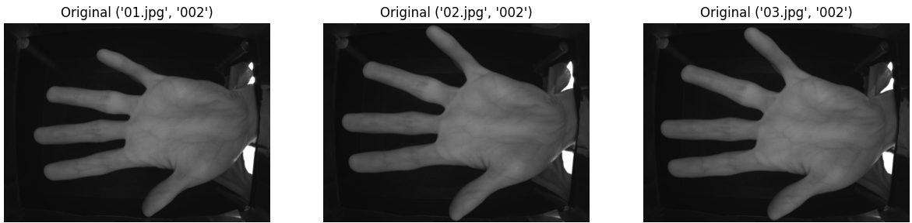
*Figure 1: Original image*

First, the hand in the image is located using thresholding. The wrist side of the image is reduced by 30% to eliminate light noise from the scanner opening.

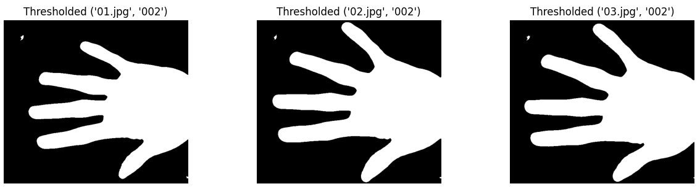
*Figure 2: Thresholded image*

Some parts of the scanner are still visible after the threshold has been applied. The longest contour is selected as the hand scan.

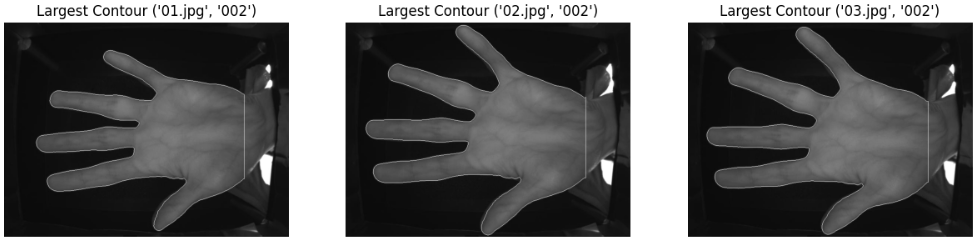
*Figure 3: Contour image*

Next, all convexity defects on the contour are located and sorted to extract 4 points of interest, which correspond to the connections between the earlier mentioned fingers. The lowest and the third lowest points are chosen based on the y-coordinate.

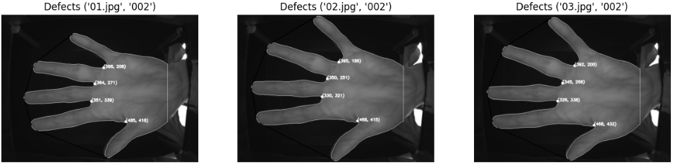
*Figure 4: Convexity defects*

A square is drawn below the line that connects the points of interest. The square is then rotated back to natural coordinates.

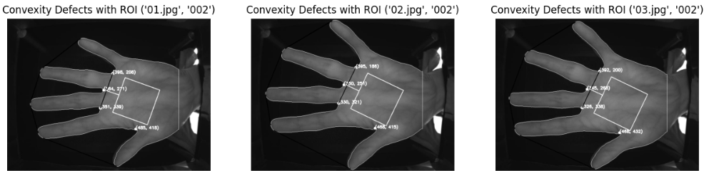
*Figure 5: ROI on palm*

Two models of feature extraction were created. The first one extracts veins more precisely but has lower accuracy, while the second uses a slightly different approach and has higher accuracy.


## Model 1

The first model follows the steps outlined below:

1. **Equalized Histogram:**
   - Apply equalized histogram using `cv2.equalizeHist`.

   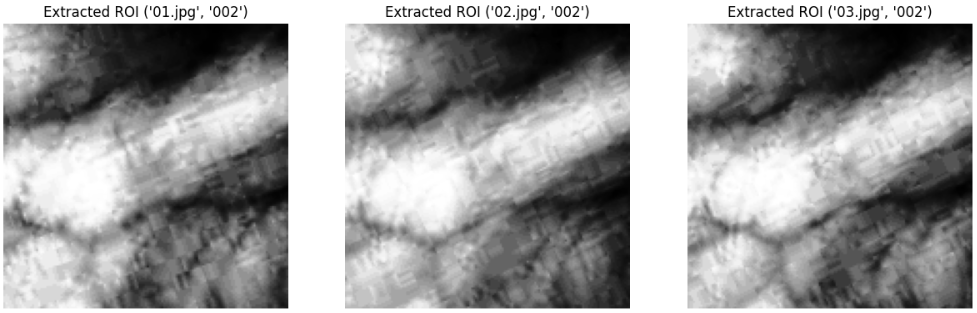
   *Figure 6: Extracted ROI after Equalized Histogram*

2. **Gabor Filter:**
   - Create a Gabor kernel with the following parameters:
     ```python
     kernel_size = 5
     sigma = 2.5
     theta = np.pi / 3
     lambda = 8.0
     gamma = 0.4
     psi = 0.0
     ```
   - Apply the Gabor filter with the kernel from one angle.

   
   *Figure 7: Extracted ROI with Gabor Filter Applied*

3. **Contrast Limited Adaptive Histogram Equalization (CLAHE):**
   - Apply CLAHE in 5 turns, each time with a larger grid size, to enhance vein features.

   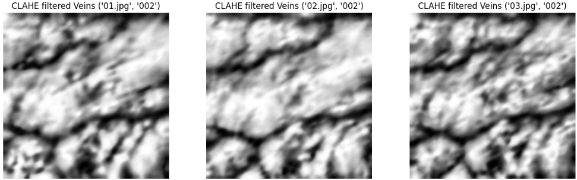
   *Figure 8: ROI after CLAHE*

4. **Binary Thresholding:**
   - Binary threshold the image again to obtain the final extracted ROI.

   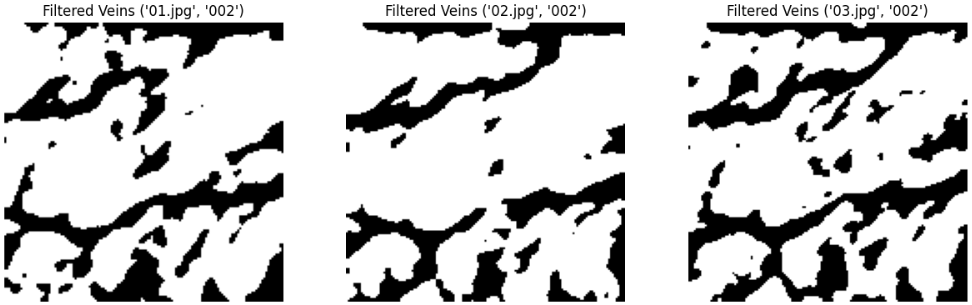
   *Figure 9: Final extracted ROI*

## Model 2

Model 2 follows the steps outlined below:

1. **ROI Extraction:**
   - Perform the same ROI extraction as in Model 1.

2. **Mask 1 Creation:**
   - Create the first mask to eliminate empty spaces based on an equalized histogram and threshold.

   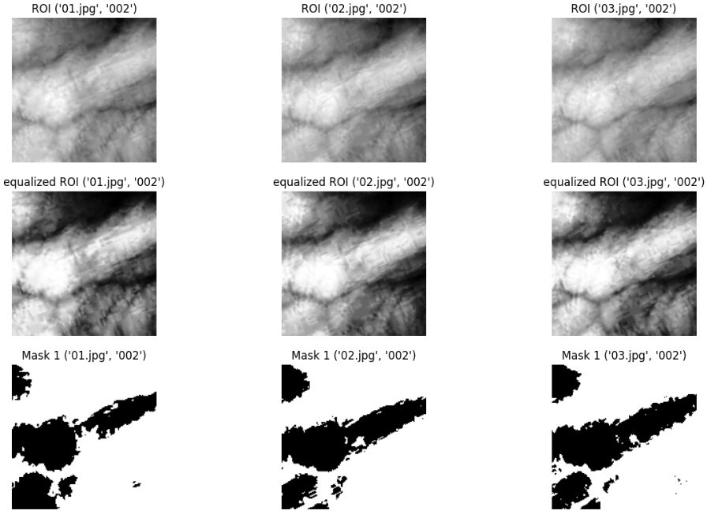
   *Figure 10: Equalized ROI and Mask 1*

3. **Mask 2 Generation:**
   - Generate the second mask as an output from the first model, with the last threshold set to `THRESH_BINARY_INV` to remove artifacts outside regions with potential veins.

   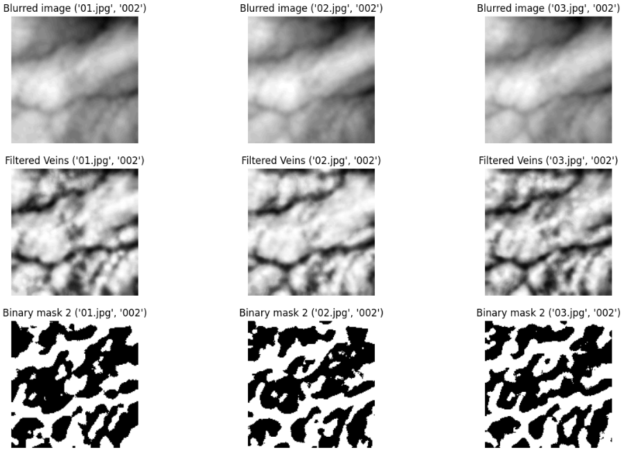
   *Figure 11: Mask 2 Generation*

4. **Gabor Filter and Mask Application:**
   - Create the ROI by employing a Gabor filter with the specified parameters.
   - Generate 48 images of the Gabor filter applied with varying theta and sigma, then average them.
   - Apply a single CLAHE filtration with adaptive thresholding to eliminate elements created between the veins.

   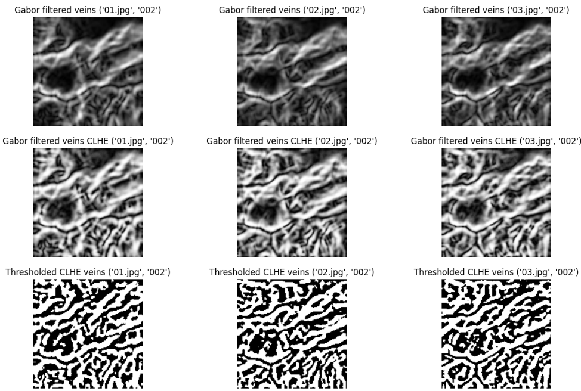
   *Figure 12: Gabor Filter and Filtered Gabor Filter*

5. **Mask Application and Morphological Opening:**
   - Apply both masks inverted to the ROI.
   - Apply morphological opening to fill in small voids with a kernel size of 5.

   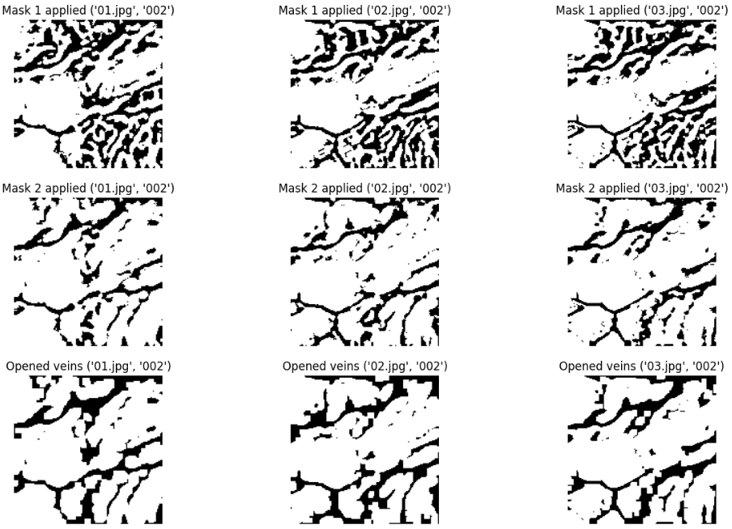
   *Figure 13: Mask Application and Morphological Opening*


## Project Setup

The project is developed using Python 3.8.10. Follow the steps below to set up the project:

1. **Create a Virtual Environment:**
   - Open a terminal and run the following command to create a virtual environment named `.venv`:
     ```bash
     python -m venv .venv
     ```

2. **Activate the Virtual Environment:**
   - Activate the virtual environment by running the following command:
     ```bash
     source .venv/bin/activate
     ```

3. **Install Requirements:**
   - Install the required packages listed in the `requirements.txt` file using the following command:
     ```bash
     pip install -r requirements.txt
     ```

## Usage

The project file structure should be organized as follows. Note that datasets are not provided in the repository due to their size (7200 images). The `images_l_940_train` directory should contain left-hand images from 100 individuals from the first scanning (300 images). There are four files for each model, marked with modelX.

```plaintext
/.
├── dataset
│   ├── images
│   ├── images_l_940_train
│   └── ...
├── evaluator_model1.sh
├── evaluator_model2.sh
├── model1_accuracy.txt
├── model1.ipynb
├── model2_accuracy.txt
├── model2.ipynb
├── requirements.txt
├── script_model1.py
└── script_model2.py
```

### script_modelX.py

The script `script_modelX.py` is designed for training and matching palm images. It supports two modes: `--train` and `--match`.

The script supports the following arguments:
```bash
usage: script_modelX.py [-h]
                    [--train base_dir original_dir destination_dir]
                    [--match trained_data_path image_to_match_path]
```

#### Train Mode
In train mode, the script processes images and saves the image with extracted features to the destination directory. After the first training, the trained data is stored locally and accessed with each subsequent iteration.

```bash
.venv/bin/python script_modelX.py --train "dataset/" "images_l_940_train/" "images_l_940_train_marked/"
```

#### Match Mode
In match mode, the script uses images from the selected directory to match the passed image.

```bash
.venv/bin/python script_model2.py --match "dataset/images_l_940_train_marked/" "dataset/images/007_l_940_05.jpg"
```

### modelX.ipynb

Has the same base as the script mentioned above, but it also plots graphs to see the extraction process. PDF version is there for better readability. 

### evaluator_model1.sh

Script to run automatic accuracy verification on the data collected in second run. If all above runs without a problem, all paths dont need any change. 

```bash
./evaluator_model1.sh

<snip>

MODEL 1

Total Matches: 194
Total Non-Matches: 106
Percentage of Matches: 64%


./evaluator_model2.sh

<snip>

MODEL 2

Total Matches: 166
Total Non-Matches: 134
Percentage of Matches: 55%
```

# Future Improvements

Some of the data is not extracted correctly as there are a lot of variables which take a toll on the quality of images.

- Hand is free-floating in space. There is no stopper to set height above the camera.
- The angle to the camera is not fixed.
- The amount of light shining beside the hand.
- 940nm light may not only capture veins but also palm lines and other distortions.
